# 🧩 Menoid — Browser Extension

> A private crypto wallet for the multi-chain world.
>
> [menoid.xyz](https://menoid.xyz)

One wallet, one address, two modes. **Open Mode** is an ordinary multi-chain
wallet. **Noid Mode** moves the same funds through a zero-knowledge privacy pool
— balances, senders, receivers and amounts stay hidden. Monad, Ethereum
Sepolia, Base Sepolia, Solana, Sui and Aptos.

The protocol, circuits and contracts live in
**[menoid-wallet/menoid](https://github.com/menoid-wallet/menoid)**, and the
full write-up is in **[menoid-wallet/Docs](https://github.com/menoid-wallet/Docs)**.

---

## 🎬 Demo

Captured against **Monad testnet** with the real contracts — every transaction
below is real.

### Create a wallet

Twelve words, a local label, a password. One seed phrase, one address; Noid Mode
is derived from it, not a second wallet.

| 1. Welcome | 2. Recovery phrase | 3. Name the account |
|---|---|---|
| 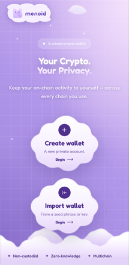 |  | 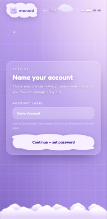 |

| 4. Set a password | 5. Wallet created | 6. Unlock |
|---|---|---|
| 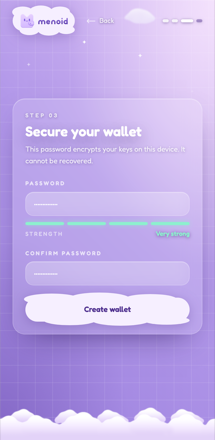 | 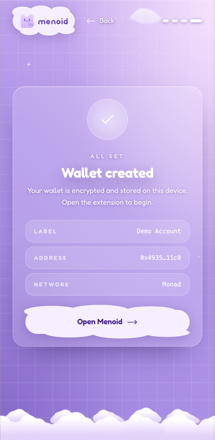 |  |

### Open Mode, then register for Noid Mode

Registering signs one message and binds your address to a private identity
on-chain. Only funded chains can register — the transaction is sent from your
own wallet.

| 7. Open Mode | 8. Pick chains to register | 9. Registered on Monad |
|---|---|---|
| 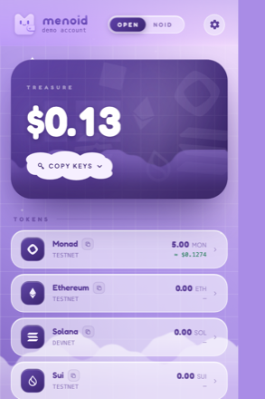 |  | 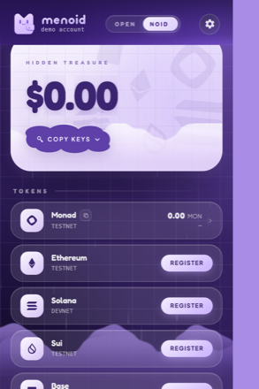 |

### Mask — public funds become private notes

| 10. Private balance | 11. Choose an amount | 12. Hidden |
|---|---|---|
| 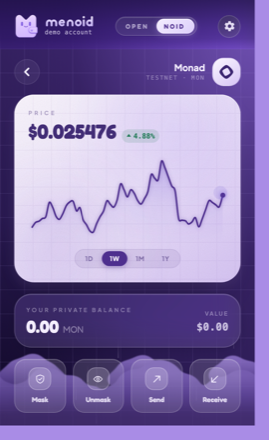 | 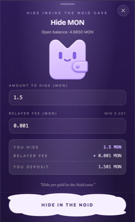 | 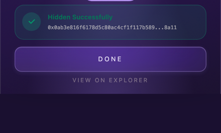 |

### Send privately

Paste an ordinary wallet address. Menoid resolves that address's private
identity **straight from the chain** — both the user commitment and the
encryption key are registered on-chain, so no server can answer wrong.

| 13. Recipient resolved on-chain | 14. Amount and fee | 15. Transfer confirmed |
|---|---|---|
| 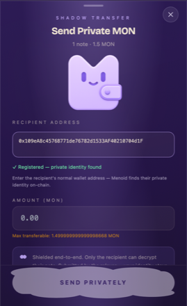 | 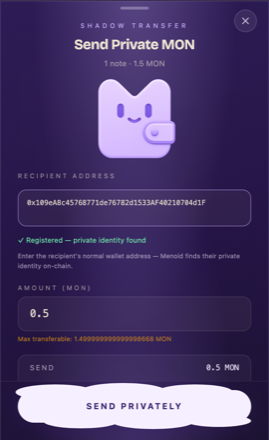 | 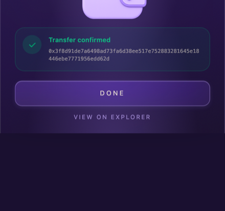 |

If the recipient has *not* registered, the send falls back to a public withdraw
straight to their wallet — and says so before you confirm.

---

## 📁 What's in here

```
.
├── wallet-extension/   the browser extension (Plasmo + React + Tailwind)
│   ├── popup.tsx           the wallet itself
│   ├── tabs/               onboarding, dapp connect, tx approval
│   ├── components/modes/   Open Mode / Noid Mode / Register views
│   ├── services/           register, mask, unmask, per-chain tx builders
│   ├── crypto/             key derivation, commitments, wallet encryption
│   ├── lib/                networks, RPC, storage, EIP-1193 provider
│   └── assets/zk/          circuit wasm + proving keys
└── backend/            the relayer (Express + MongoDB)
    ├── controllers/        register, deposit/withdraw, transfer, per chain
    ├── indexer/            pool state per chain
    └── helpers/            merkle, commitments, proof plumbing
```

**The relayer broadcasts; it never custodies.** Transactions are signed on the
device and posted as signed bytes. The relayer pays gas so a user does not have
to spend from the address they are keeping private, and is paid with a note the
same proof creates. It can refuse to broadcast — it cannot steal, forge, or see
amounts.

---

## 🚀 Running it

### Extension

```bash
cd wallet-extension
npm install
npm run dev          # load build/chrome-mv3-dev as an unpacked extension
npm run build        # build/chrome-mv3-prod
```

### Relayer

```bash
cd backend
npm install
npm start            # PORT=4000 by default
```

Both read a `.env` that is not committed. The extension's holds
`PLASMO_PUBLIC_*` pool addresses and RPC endpoints (build-time constants —
change one and rebuild); the backend's holds the Mongo URI, the relayer key and
the same addresses. Keep them in step with
[`menoid/deploy.txt`](https://github.com/menoid-wallet/menoid/blob/main/deploy.txt)
— a stale address silently points the wallet at an abandoned pool.

---

## 🔗 Related

| Repository | What it is |
|---|---|
| ⛓️ **[menoid-wallet/menoid](https://github.com/menoid-wallet/menoid)** | Circuits and on-chain contracts |
| 📖 **[menoid-wallet/Docs](https://github.com/menoid-wallet/Docs)** | Protocol documentation |
| 📱 **[menoid-wallet/wallet-android](https://github.com/menoid-wallet/wallet-android)** | The Android app |
| 🌐 **[menoid-wallet/website](https://github.com/menoid-wallet/website)** | [menoid.xyz](https://menoid.xyz) |

---

## ⚠️ Status

Testnet. Unaudited. Do not put real funds anywhere near this.

---

**Menoid — A Private Crypto Wallet.**
